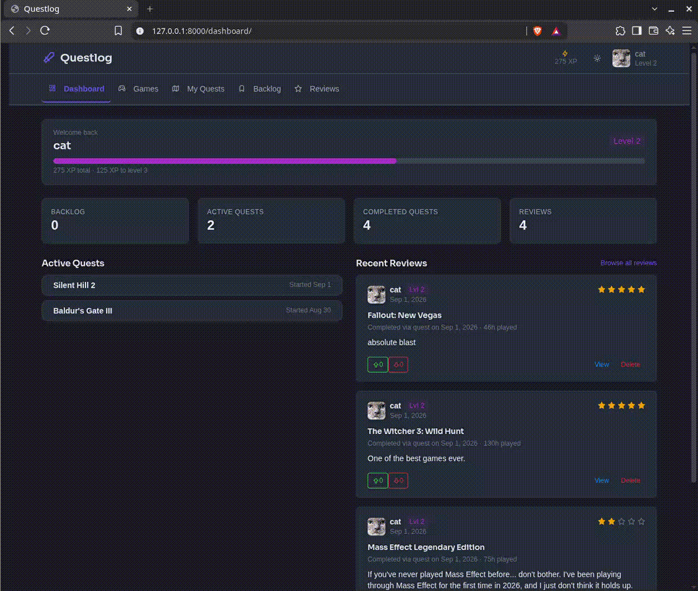
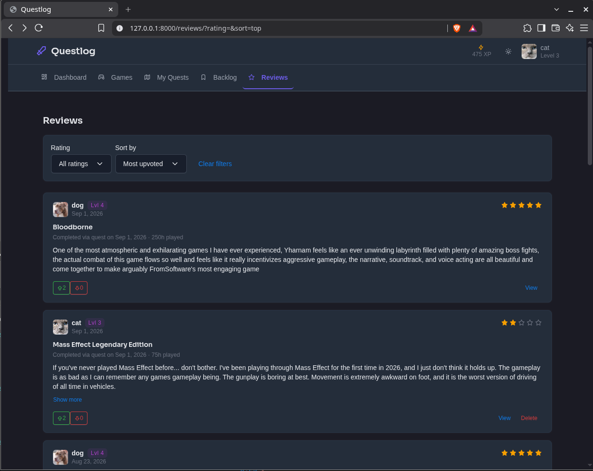
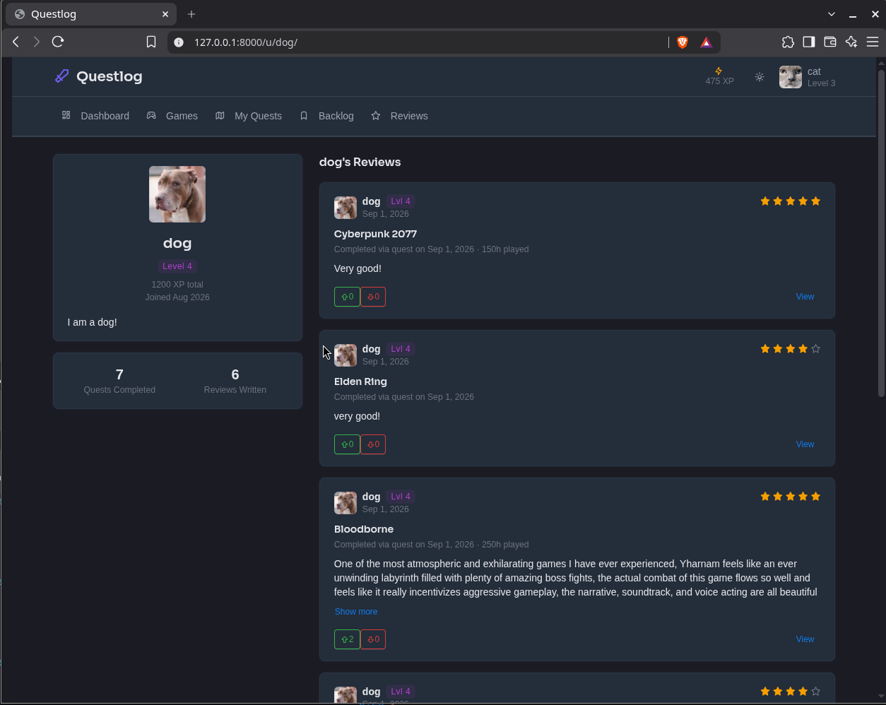

# Quest Log

Quest Log is a gamified video game backlog app built with Django.

I built this project as a way to learn Django by working on something a bit more involved than a simple blog or todo app. The main idea is to turn a game backlog into a set of quests. A user can add games to their backlog, start a quest for a game, optionally add challenges, and complete the quest by writing a review.

Completing quests gives the user XP and helps them level up their profile.

## Demo



<p align="center">
  
  
</p>

## Features

- User registration and authentication
- Email verification
- Public user profiles
- Game discovery and search
- Game genres and game details
- Personal game backlog
- Quest system with three states: active, completed, and abandoned
- Optional challenges for quests
- XP and user levels
- Game reviews with 1–5 star ratings
- Upvotes and downvotes on reviews
- Pagination for game and review lists
- User-specific access control
- Responsive UI with Tabler

## How it works

The main flow of the app is:

```text
Find a game
    ↓
Add it to your backlog
    ↓
Start a quest
    ↓
Optionally add challenges
    ↓
Play the game
    ↓
Write a review
    ↓
Quest is completed
    ↓
XP is awarded
    ↓
User levels up
```

A quest can also be abandoned before it is completed.

## Tech Stack

- Python
- Django 5.2
- PostgreSQL
- Django ORM
- django-allauth
- django-crispy-forms
- Tabler UI
- Docker / Docker Compose
- Gunicorn
- WhiteNoise
- Pillow

## Project Structure

The project is split into several Django apps based on their responsibilities:

```text
apps/
├── accounts/    # Users, profiles, XP and levels
├── games/       # Games, genres and user backlog
├── pages/       # Dashboard and general pages
├── quests/      # Quests and challenges
└── reviews/     # Reviews and review voting

django_project/
└── settings/    # Base, local and production settings

templates/       # HTML templates
static/          # Static files
```

I kept the apps separated so that each part of the project has a clear responsibility instead of putting most of the logic into one Django app.

## Some Technical Details

### Quest and Challenge relationship

A quest can have multiple challenges, but challenge completion belongs to a specific quest.

For that reason, the project uses a `QuestChallenge` intermediate model instead of a simple many-to-many relationship. This allows the same challenge to be used in different quests while keeping its completion state separate for each quest.

### XP and levels

Every completed quest awards a base amount of XP. Additional XP can come from the challenges attached to the quest.

The user's level is calculated from their total XP.

XP updates use Django's `F()` expressions so that concurrent updates don't rely on a simple read-modify-write operation.

### Reviews and voting

A user can write one review for a game after completing a quest for that game.

Reviews can be upvoted or downvoted, and a user can only vote on a review once.

The review list also uses queryset annotations for vote counts instead of running separate queries for every review.

### Database queries

I used `select_related`, `prefetch_related`, and queryset annotations in places where related data is displayed together.

The goal is to avoid unnecessary database queries, especially N+1 query patterns in lists.

## Running the Project Locally

### Requirements

You will need:

- Docker
- Docker Compose

You can also run the project without Docker, but the included Docker setup is the recommended way to get the development environment running.

### 1. Clone the repository

```bash
git clone https://github.com/KiaNouri/quest-log.git
cd quest-log
```

### 2. Create the environment file

Create a `.env` file in the project root.

For local development, you will need the environment variables used by Django and PostgreSQL.

Example:

```env
SECRET_KEY=your-secret-key

POSTGRES_DB=questlog
POSTGRES_USER=questlog
POSTGRES_PASSWORD=your-password

DATABASE_URL=postgres://questlog:your-password@db:5432/questlog

DJANGO_ALLOWED_HOSTS=localhost,127.0.0.1

EMAIL_HOST_USER=
EMAIL_HOST_PASSWORD=
```

### 3. Start the containers

```bash
docker compose up --build
```

Django will be available at:

```text
http://localhost:8000
```

The container runs migrations when it starts and uses Gunicorn as the web server.

## Running Tests

To run the test suite:

```bash
docker compose run --rm web python manage.py test
```

The tests cover different parts of the application, including authentication, authorization, quest creation and lifecycle, backlog behavior, and model constraints.

## Production Setup

The project includes separate production settings and is configured to run with:

- Gunicorn
- PostgreSQL
- WhiteNoise
- `DEBUG=False`
- environment-based configuration
- HTTPS-related security settings
- static file collection
- production database configuration

The Docker image also runs `collectstatic` during the build and uses a non-root user inside the container.

I have prepared the project for deployment, but it is intentionally not deployed as a public service. This is a learning and portfolio project rather than a live product.

## What's Next?

The next step for this project is building a REST API with Django REST Framework.

The plan is to expose the main parts of Quest Log through an API, including games, backlogs, quests, reviews, and user profiles, while adding API authentication, permissions, serializers, filtering, pagination, and API tests.

## Why I Built This

This project started as a Django learning project.

Instead of following tutorials without building something of my own, I wanted to use the concepts I was learning to build a project from start to finish and gradually make it more realistic.

The project is still a work in progress, and I plan to keep improving it as I learn more about Django and backend development.

## License

This project is licensed under the MIT License.
